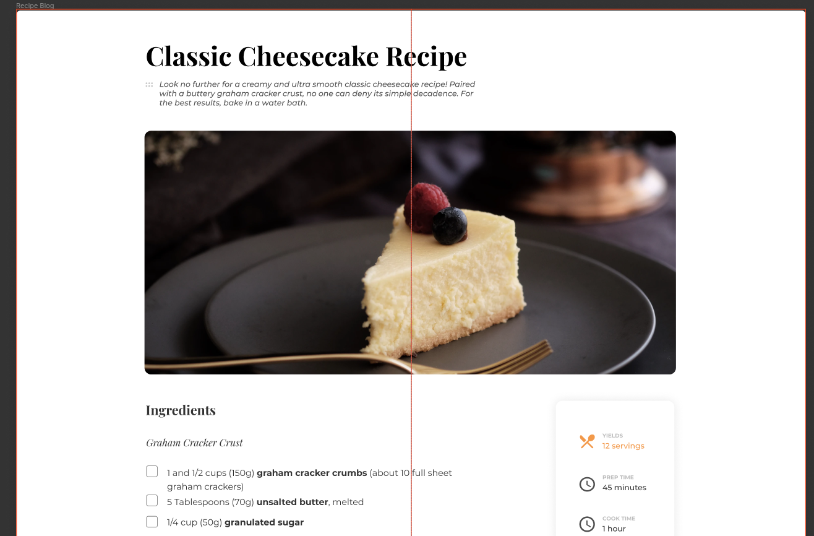

<!-- Please update value in the {}  -->

<h1 align="center">Recipe Page Master</h1>

   Solution for a challenge from  <a href="http://devchallenges.io" target="_blank">Devchallenges.io</a>.

  <h3>
    <a href="https://recipe-page-master.netlify.app/">
      Demo
    </a>
     | 
    <a href="https://devchallenges.io/challenges/OEKdUZ6xs0h99C38XVht">
      Challenge
    </a>
  </h3>

<!-- TABLE OF CONTENTS -->

## Table of Contents

- [Overview](#overview)
  - [Built With](#built-with)
- [How to use](#how-to-use)
- [Contact](#contact)
<!-- - [Acknowledgements](#acknowledgements) -->

<!-- OVERVIEW -->

## Overview

### Built With

<!-- This section should list any major frameworks that you built your project using. Here are a few examples.-->

Basic HTML and CSS

## How To Use
Clone the repo and open index.html in your web browser

## Acknowledgements

<!-- This section should list any articles or add-ons/plugins that helps you to complete the project. This is optional but it will help you in the future. For exmpale -->

## Contact

- GitHub [@devalde](https://github.com/devalade)
- Twitter [@dev_alade](https://twitter.com/dev_alade)
